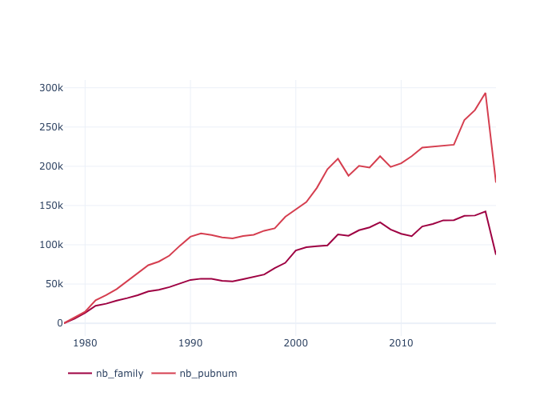
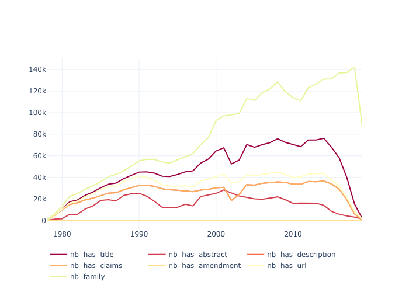
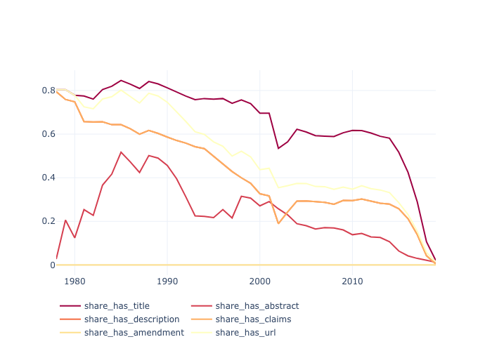
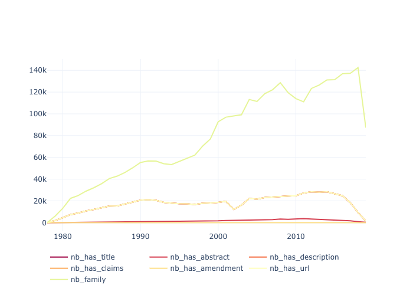
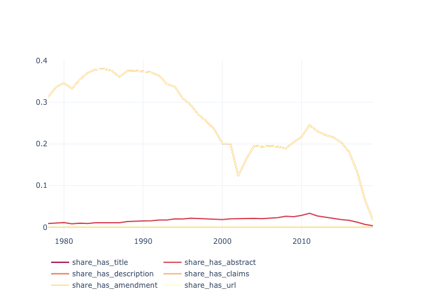
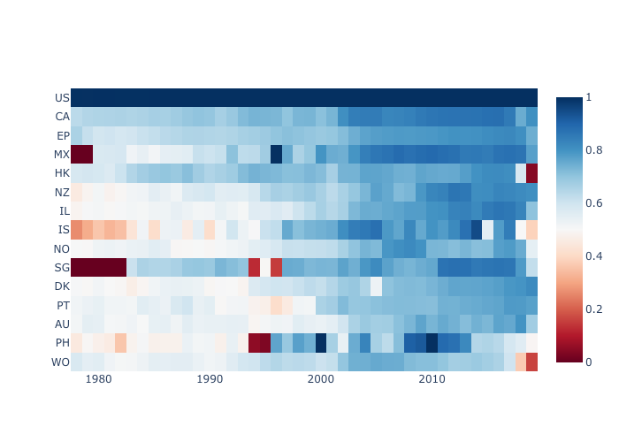
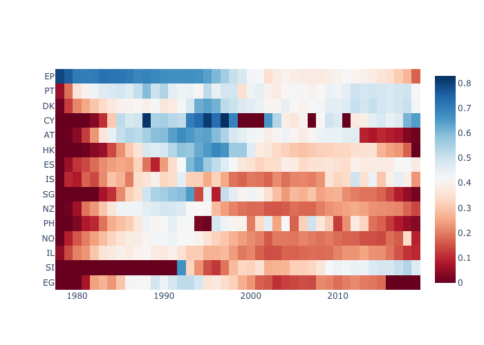
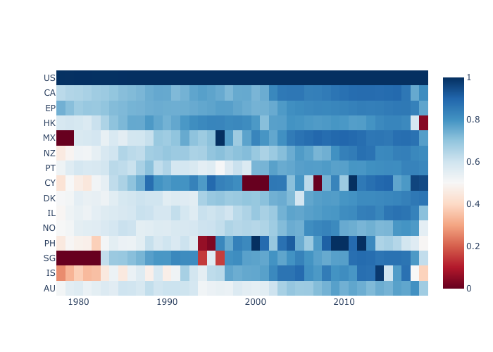

[uspto-bulk]:https://bulkdata.uspto.gov/
[iamlemec/patents]:https://github.com/iamlemec/patents
[patents-public-data]:https://console.cloud.google.com/bigquery?project=npl-parsing&p=patents-public-data&d=patents&t=publications&page=table
[eda]:https://github.com/cverluise/parseEPO/

# Quick Start

Figures and analyses reported below can be reproduced using the material in the [exploratory data analysis][eda] folder.

## EP data (1978-2019)

#### Number of EPO patents and patent families

!!! info "Patent family"
    A patent family is a collection of patent applications covering the same or similar technical content.
    The applications in a family are related to each other through priority claims.

From now on, we work at the family level. Each family is assigned to the year of it first appearance in the EP full-text patent dataset. This date might differ from its priority year.

## EP full-text data (1978-2019)

####  Number and share of EPO patent families *with* full-text data

Number | Share
:-------------------------:|:-------------------------:
  |  

| |title|abstract|description|claims |amendment|url|
|---|---|---|---|---|---|---|
|1978-2019|0.6|0.2|0.33|0.33|0.0|0.41|

Overall, 1/3 of EP families have at least one patent with a full-text description.

####  Number and share of EPO patents and patent families *with* full-text data in *english*

Number | Share
:-------------------------:|:-------------------------:
  |  

||en_title|en_abstract|en_description|en_claims|en_amendment|en_url|
|---|---|---|---|---|---|---|
|1978-2019|0.22|0.02|0.22|0.22|0.0|0.22|

Overall, 1/5 of EP families have at least one patent with a full-text description in *english*.

## Worldwide coverage of full-text patent data

!!! tip "Leverage patent families to enlarge full-text data coverage"
    Patents in the same (simple) family usually have the same text components. This means that any patent text can be propagated to all patents in the same family. Thanks to that, the EP (resp US) full text data can cover patents well beyond the the EP (resp US) office. We use this tip to look at the implicit worldwide coverage of the EP and US full-text patents.

In this section we focus on the availability of the full-text patent **descriptions**.

#### USPTO and EPO full-text patent description data coverage

!!! info "USPTO full text data"
    The USPTO full text data are available from the [USPTO bulk data][https://bulkdata.uspto.gov/]. US full-text patent data can be easily parsed thanks to [iamlemec/patents][iamlemec/patents]. They are also available in a well-structured format as part of the BigQuery [patents-public-dataset][patents-public-data].

USPTO | EPO
:-------------------------:|:-------------------------:
 | 

Paradoxically, we observe that the **USPTO** full-text data implicitly covers a larger share of **EP** families than the EP bulk dataset.

#### The best of both worlds

We can also pool the families covered by the EPO and the USPTO full-text bulk datasets. This is the largest coverage of full-text patent data that can be obtained from publicly available datasets.

